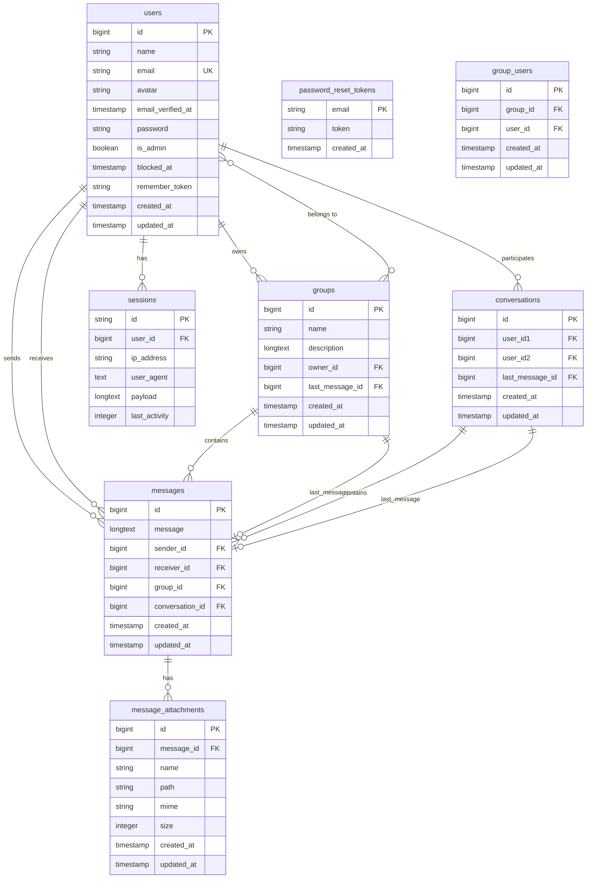

<p align="center">
  
</p>

<h1 align="center">Pulse Messenger</h1>

<p align="center"><i>
A modern, real-time messaging application built with Laravel 12, React 18, and Laravel Reverb for WebSocket communication. Pulse Messenger enables instant messaging with support for private conversations, group chats, file attachments, and real-time presence indicators.
</i></p>

---

<p align="center">
  
  
  
  
  
</p>

---

## Developed by:
### Md. Tahmid Rahman, ID: 232-134-039, SWE 5th
### Sadman Islam, ID: 232-134-013, SWE 5th

#### [Overview Video Link](https://drive.google.com/file/d/1_a4FUp-Z2qFeuVv5l6NljxUTyidpVKpG/view?usp=sharing)

---

## Live Demo

**Live Link:** [https://pulse-messenger-7xex.onrender.com](https://pulse-messenger-7xex.onrender.com)

**Demo Admin Credentials:**
| Field | Value |
|-------|-------|
| Email | `test@admin.com` |
| Password | `12121212` |

> **Note:** The free hosting may take ~50 seconds to wake up on first visit if inactive.

---

## Features

### Core Messaging
- **Real-time Messaging** - Instant message delivery using Laravel Reverb WebSockets
- **Private Conversations** - One-on-one direct messaging between users
- **Group Chats** - Multi-user group conversations with member management
- **Message Attachments** - Support for images, videos, and file uploads
- **Emoji Support** - Built-in emoji picker for expressive messaging
- **Markdown Rendering** - Messages support Markdown with syntax highlighting
- **Message Deletion** - Users can delete their own messages

### User Presence
- **Online/Offline Status** - Real-time presence indicators (green dot for online users)
- **Last Activity Tracking** - Session-based user activity monitoring

### Authentication & Authorization
- **User Registration & Login** - Secure authentication via Laravel Breeze
- **Email Verification** - Optional email verification support
- **Password Management** - Password reset and change functionality
- **Profile Management** - Edit profile details and delete account

### Administration
- **Admin Dashboard** - Admin-only features for user management
- **Create Users** - Admins can create new user accounts via modal
- **Role Management** - Toggle users between Admin and Regular roles
- **Block/Unblock Users** - Suspend and reactivate user accounts

### User Experience
- **Responsive Design** - Works seamlessly on desktop and mobile devices
- **Dark Theme Support** - Modern UI powered by DaisyUI
- **Infinite Scroll** - Load older messages on scroll
- **Attachment Downloads** - Direct downloads for message attachments

---

### Tech Stack

### Backend
| Technology | Purpose |
|------------|---------|
| **Laravel 12** | PHP Framework |
| **Laravel Reverb** | WebSocket Server |
| **Laravel Breeze** | Authentication Scaffolding |
| **Inertia.js** | Server-side Routing |

### Frontend
| Technology | Purpose |
|------------|---------|
| **React 18** | UI Framework |
| **TailwindCSS 3** | Styling |
| **DaisyUI 5** | UI Component Library |
| **Laravel Echo** | Real-time Events |
| **Heroicons** | Icon Library |
| **react-markdown** | Markdown Rendering |
| **react-syntax-highlighter** | Code Syntax Highlighting |
| **emoji-picker-react** | Emoji Selector |

### Development Tools
| Tool | Purpose |
|------|---------|
| **Vite 7** | Build Tool |
| **ESLint** | Code Linting |

---

## Database Schema

### Tables Overview



### Table Descriptions

| Table | Description |
|-------|-------------|
| `users` | Stores user accounts with authentication data, admin status, and blocking info |
| `sessions` | Manages user sessions for authentication and online status tracking |
| `password_reset_tokens` | Stores password reset tokens for email-based recovery |
| `groups` | Represents group chat rooms with name, description, and owner |
| `group_users` | Pivot table linking users to groups (many-to-many relationship) |
| `conversations` | Represents private one-on-one conversations between two users |
| `messages` | Stores all messages for both private and group conversations |
| `message_attachments` | Stores metadata for files attached to messages |

---

## Installation & Setup

### Prerequisites

- PHP 8.2 or higher
- Composer
- Node.js 18+ and npm
- MySQL / MariaDB / SQLite
- XAMPP, Laravel Herd, or similar local server

### Step-by-Step Installation

#### 1. Clone the Repository

```bash
git clone https://github.com/mdtahmidrahman/pulse-messenger.git
cd pulse-messenger
```

#### 2. Install PHP Dependencies

```bash
composer install
```

#### 3. Install Node.js Dependencies

```bash
npm install
```

#### 4. Environment Configuration

```bash
# Copy the example environment file
cp .env.example .env

# Generate application key
php artisan key:generate
```

#### 5. Configure Environment Variables

Edit the `.env` file with your settings:

```env
# Application
APP_NAME="Pulse Messenger"
APP_URL=http://localhost:8000

# Database (MySQL example)
DB_CONNECTION=mysql
DB_HOST=127.0.0.1
DB_PORT=3306
DB_DATABASE=pulse_messenger
DB_USERNAME=root
DB_PASSWORD=your_password

# Or SQLite (simpler setup)
# DB_CONNECTION=sqlite

# Broadcasting (Laravel Reverb)
BROADCAST_CONNECTION=reverb

REVERB_APP_ID=my-app-id
REVERB_APP_KEY=my-app-key
REVERB_APP_SECRET=my-app-secret
REVERB_HOST=localhost
REVERB_PORT=8085
REVERB_SCHEME=http

# Vite settings for Reverb
VITE_REVERB_APP_KEY="${REVERB_APP_KEY}"
VITE_REVERB_HOST="${REVERB_HOST}"
VITE_REVERB_PORT="${REVERB_PORT}"
VITE_REVERB_SCHEME="${REVERB_SCHEME}"
```

#### 6. Database Setup

```bash
# Run migrations
php artisan migrate

# (Optional) Seed with sample data
php artisan db:seed
```

#### 7. Storage Link

```bash
php artisan storage:link
```

### Running the Application

You need to run **4 separate terminal processes**:

#### Terminal 1 - Laravel Development Server
```bash
php artisan serve
```

#### Terminal 2 - Vite Dev Server (Frontend)
```bash
npm run dev
```

#### Terminal 3 - Laravel Reverb WebSocket Server
```bash
php artisan reverb:start --host=0.0.0.0 --port=8085
```

#### Terminal 4 - Queue Worker (Optional, for background jobs)
```bash
php artisan queue:listen
```

### Quick Start (All-in-One)

Alternatively, use the composer script to run everything:

```bash
composer dev
```

This runs all servers concurrently using `npx concurrently`.

### Access the Application

- **Frontend**: http://localhost:8000
- **WebSocket**: ws://localhost:8085

---

## Project Structure

```
pulse-messenger/
├── app/
│   ├── Events/
│   │   ├── SocketMessage.php
│   │   └── SocketMessageDeleted.php
│   ├── Http/
│   │   ├── Controllers/
│   │   │   ├── HomeController.php
│   │   │   ├── MessageController.php
│   │   │   ├── ProfileController.php
│   │   │   └── UserController.php
│   │   ├── Middleware/
│   │   │   └── AdminUser.php
│   │   ├── Requests/ 
│   │   └── Resources/
│   └── Models/
│       ├── User.php
│       ├── Group.php
│       ├── Conversation.php
│       ├── Message.php
│       └── MessageAttachment.php
├── database/
│   ├── migrations/
│   ├── factories/
│   └── seeders/
├── resources/
│   └── js/
│       ├── Components/
│       │   └── App/
│       ├── Layouts/
│       └── Pages/
├── routes/
│   ├── web.php
│   ├── auth.php
│   └── channels.php
└── ...
```

---

## API Routes

### Public Routes (Authenticated)

| Method | URI | Controller | Description |
|--------|-----|------------|-------------|
| `GET` | `/` | `HomeController@home` | Main chat interface |
| `GET` | `/user/{user}` | `MessageController@byuser` | Load private conversation |
| `GET` | `/group/{group}` | `MessageController@byGroup` | Load group conversation |
| `POST` | `/message` | `MessageController@store` | Send a new message |
| `DELETE` | `/message/{message}` | `MessageController@destroy` | Delete a message |
| `GET` | `/load-older/{message}` | `MessageController@loadOlder` | Paginate older messages |
| `GET` | `/message/attachment/{attachment}` | `MessageController@downloadAttachment` | Download attachment |

### Admin Routes

| Method | URI | Controller | Description |
|--------|-----|------------|-------------|
| `POST` | `/user` | `UserController@store` | Create new user |
| `POST` | `/user/change-role/{user}` | `UserController@changeRole` | Toggle admin status |
| `POST` | `/user/block-unblock/{user}` | `UserController@blockUnblock` | Block/unblock user |

### Profile Routes

| Method | URI | Controller | Description |
|--------|-----|------------|-------------|
| `GET` | `/profile` | `ProfileController@edit` | Edit profile page |
| `PATCH` | `/profile` | `ProfileController@update` | Update profile |
| `DELETE` | `/profile` | `ProfileController@destroy` | Delete account |

---

## WebSocket Channels

| Channel | Description | Authorization |
|---------|-------------|---------------|
| `online` | Presence channel for online status | Authenticated users |
| `message.user.{userId1}-{userId2}` | Private messaging channel | Only the two participants |
| `message.group.{groupId}` | Group messaging channel | Group members only |

---

## Future Works

### High Priority

- [ ] **Full Group CRUD Operations**
  - [ ] Create new groups with member selection
  - [ ] Edit group name and description
  - [ ] Delete groups (owner only)
  - [ ] Add/remove group members
  - [ ] Leave group functionality
  - [ ] Group admin/moderator roles

- [ ] **Message Enhancements**
  - [ ] Edit sent messages
  - [ ] Reply to specific messages
  - [ ] Forward messages to other chats
  - [ ] Message read receipts
  - [ ] Typing indicators

### Medium Priority

- [ ] **Search Functionality**
  - [ ] Search messages within conversations
  - [ ] Global message search
  - [ ] Search users

- [ ] **Media Enhancements**
  - [ ] Image preview modal
  - [ ] Video player
  - [ ] Voice messages
  - [ ] GIF support

- [ ] **User Features**
  - [ ] User avatars upload
  - [ ] User bio/status
  - [ ] Last seen timestamps
  - [ ] Mute conversations

### Nice to Have

- [ ] **Performance**
  - [ ] Message caching
  - [ ] Image compression
  - [ ] Lazy loading for media

- [ ] **Advanced Features**
  - [ ] Push notifications
  - [ ] Desktop notifications
  - [ ] Message reactions (emoji)
  - [ ] Pin important messages
  - [ ] Starred messages
  - [ ] Archive conversations

- [ ] **Security & Privacy**
  - [ ] End-to-end encryption
  - [ ] Two-factor authentication
  - [ ] Message auto-deletion

---
